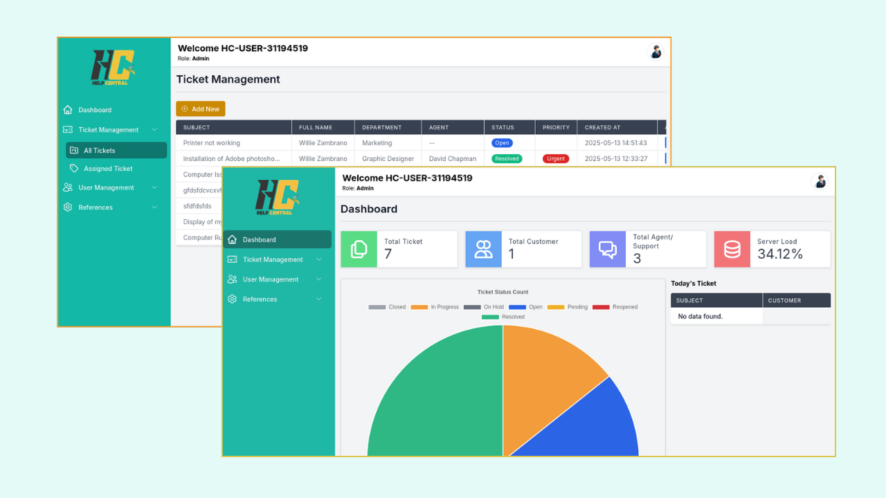

# 🎫 Ticketing System

A web-based support ticketing system that helps manage customer inquiries, assign issues to support agents, role-based dashboard.

---

## 🚀 Features

-   🧑‍💼 **Role-Based Dashboards**  
    Separate views and insights for Admins and Agents.

-   📝 **Ticket Management**  
    Create, update, assign, and resolve support tickets.

-   📊 **Dashboard Analytics**

    -   Ticket count per status (Pie Chart)
    -   Ticket volume over time (Line Chart)

-   👥 **User Roles**

    -   Admins (manage all tickets, users, and agents)
    -   Agents (handle assigned tickets)

-   💬 **Real-Time Communication**  
     Realtime chat between customer, assigned agent and admin in Ticket view page

---

## 🛠️ Tech Stack

-   **Backend:** Laravel, Livewire
-   **Frontend:** Blade, Alpine.js, Tailwind CSS
-   **Charts:** Chart.js
-   **Database:** MySQL

---
